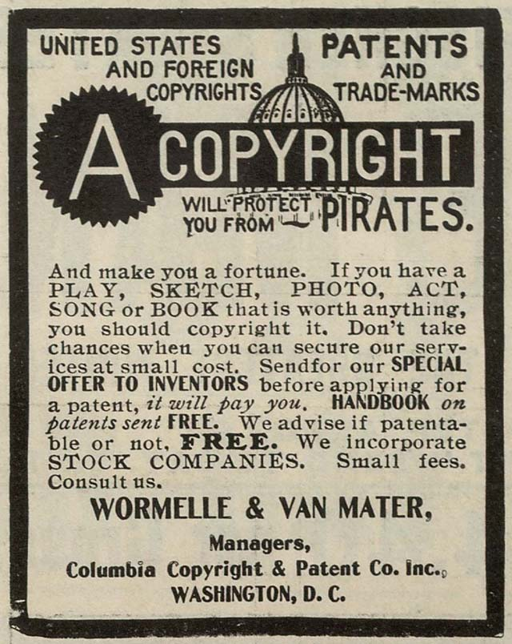
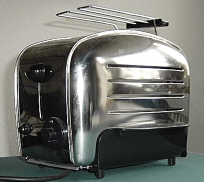
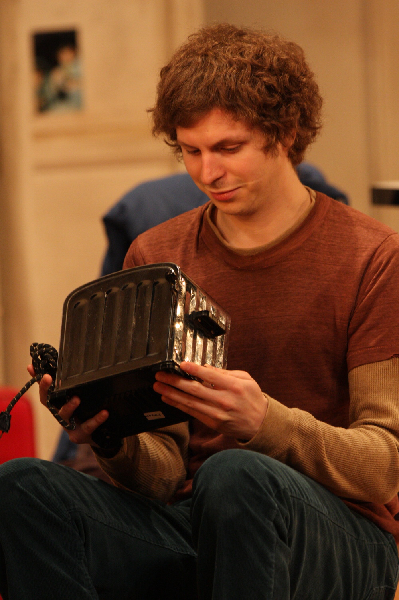

A Day in the Life of a  Cylon: Tracking Search Automata
========================================================
author: Oliver Keyes & Trey Jones, with Special Guest Michael Cera
date: 2015-08-17

Top Zero-Result Queries
========================================================

* TL;DR: not many queries, not many humans.

Top Zero-Result Queries
========================================================

>  *"ou as I can get tonight without being detected, and Tuck and Clay will be there too, along with an undercover team. You’ll have an earpiece no one will be able to see, so we"*

(Tuck and Clay have refused to answer press questions as to their involvement in our API usage and have referred us to their attorneys)

Pattern the first: TIMESTAMPS
========================================================

* 1433765841464:Mobile operating system
* 1437255372537:Stanley Tucci
* 1438038149279:The Devil Wears Prada (film)

Pattern the second: CINEFILES
========================================================

* "BBC Weird Nature S1E6" film
* "Babylon 5 Episodes 13-16" film
* "[Classic Sci-Fi ] Attack Of The Giant Leeches" film

Pattern the third: TRAVELLING SALESMEN
========================================================

* "Ahimsa" AND "Milk substitute"
* "Ahimsa" AND "Round Table Conferences (India)"
* "Sheep" AND "Nativity of Jesus in art"

========================================================

Timestamps
========================================================

Cinefiles
========================================================

Travelling salesmen
========================================================

Questions?
========================================================

Credits
========================================================

* Cat: Slava (CC-BY 2.0) https://commons.wikimedia.org/wiki/File:Lolwut_cat.jpg
* Dan: Myleen Hollero (CC-BY-SA 3.0) https://commons.wikimedia.org/wiki/File:Garry,_Dan_Sept_2013.jpg
* Pirates: Columbia Copyright Office (public domain) https://commons.wikimedia.org/wiki/File:Copyrightpirates.jpg
* Toaster: Peng (CC-BY-SA 3.0) https://commons.wikimedia.org/wiki/File:Toaster1.jpg
* Michael Cera: Eva Rinaldi (CC-BY-SA 2.0) https://commons.wikimedia.org/wiki/File:Michael_Cera_%286986385297%29.jpg
